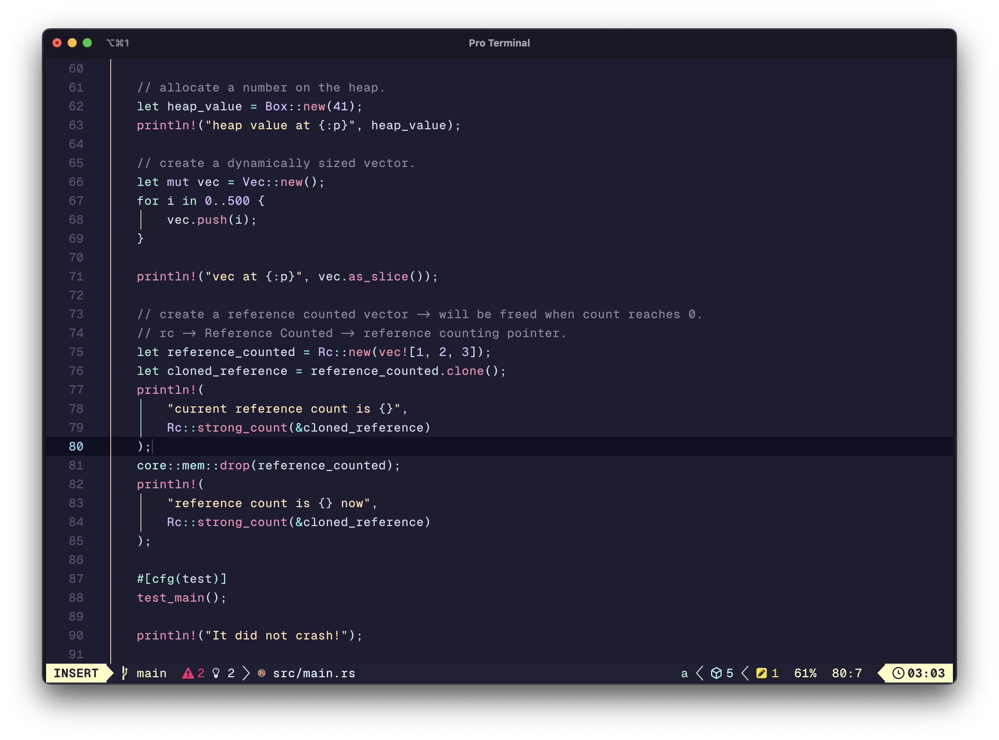

<div align=center>
  <h1>embark-lua.nvim</h1>
</div>

<p align="center"><strong>An ambitious Vim theme.</strong></p>

<p align="center"><em>"Man cannot discover new oceans unless he has the courage to lose sight of the shore. - Andre Gide"</em></p>

<div align=center>
  
</div>

## About

This is a rewrite of original theme [embark](https://github.com/embark-theme/vim) in lua, All credits for color palette and idea should goes to the author.
Rewriting in lua brings better support for treesitter, lualine and other commonly used nvim plugins.

## Getting Started

First install using your plugin manager. Rename package to embark using your plugin manager's built in facilities to do so.

### lazy.nvim

```lua
return {
  "genzyy/embark-lua.nvim",
  name = "embark",
}
```

### packer.nvim
```lua
use { 'genzyy/embark-lua.nvim', as = 'embark' }
```

### vim-plug
```vim
Plug 'genzyy/embark-lua.nvim', { 'as': 'embark', 'branch': 'main' }
```

Then set embark as colorscheme.

Vimscript

```vim
colorscheme embark
```

Lua for neovim

```lua
vim.cmd('colorscheme embark')
```

For packer users the colorscheme can be placed in the config callback.

```lua
use {
  'genzyy/embark-lua.nvim',
  as = 'embark',
  config = function()
    vim.cmd('colorscheme embark')
  end
}
```

### Lightline support

A lightline theme is also available. Just set your colorscheme to embark.

```vim
let g:lightline = {
      \ 'colorscheme': 'embark',
      \ }
```

### Airline support

Airline should just pick up on theme automatically, but if there is an issue with this it can be set manually.
`let g:airline_theme = 'embark'`

### Lualine support

Lualine should pick up the theme with the `auto` setting, or you can set it manually.

```lua
require('lualine').setup {
  options = {
    theme = 'embark',
  }
}
```

### User configuration

```lua
  config = function()
    require("embark").setup({
      styles = {
        keywords = { italic = true, bold = true }, -- default
        comments = { italic = true, bold = false }, -- default
      },
    })
  end

```


### Todo

- [x] user configuration.
- [ ] support for other nvim plugins.
- [ ] light variant.
